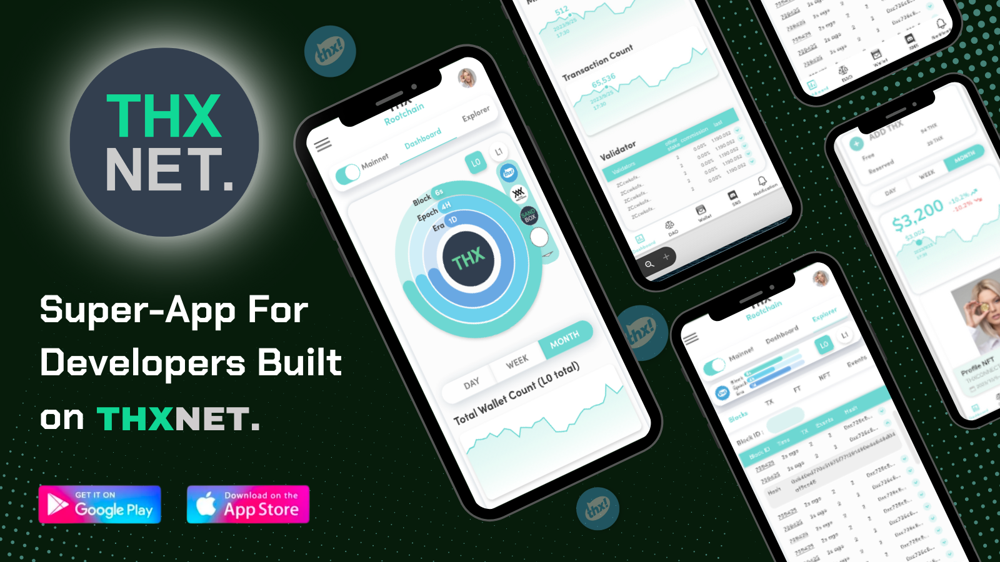
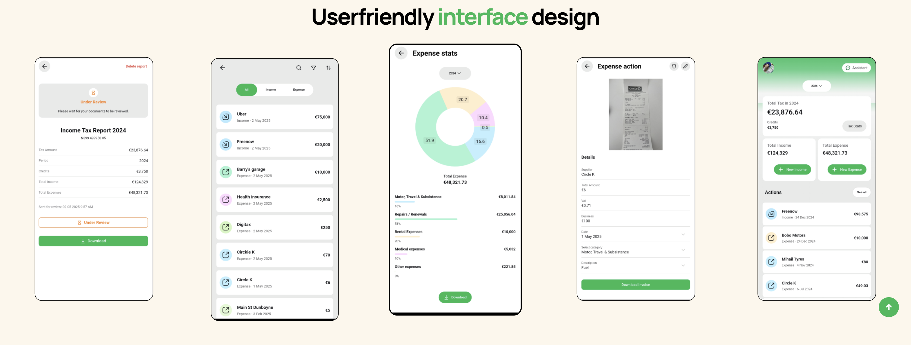
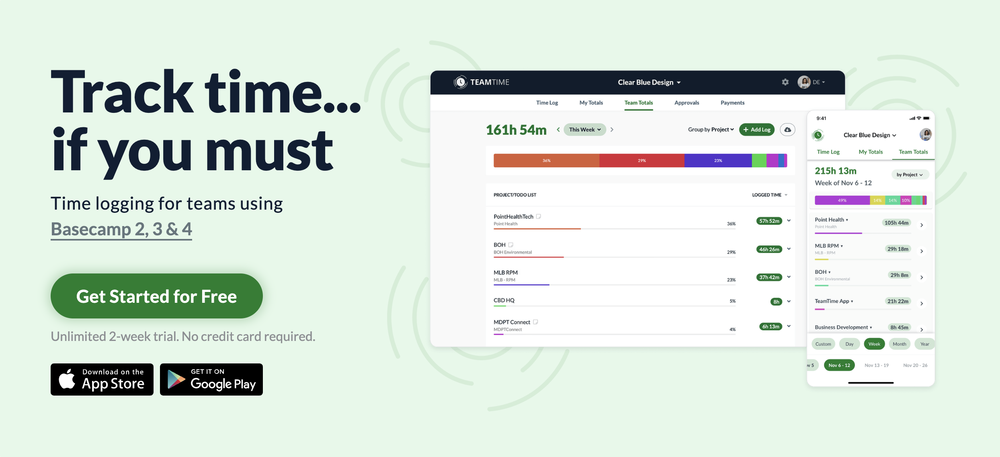
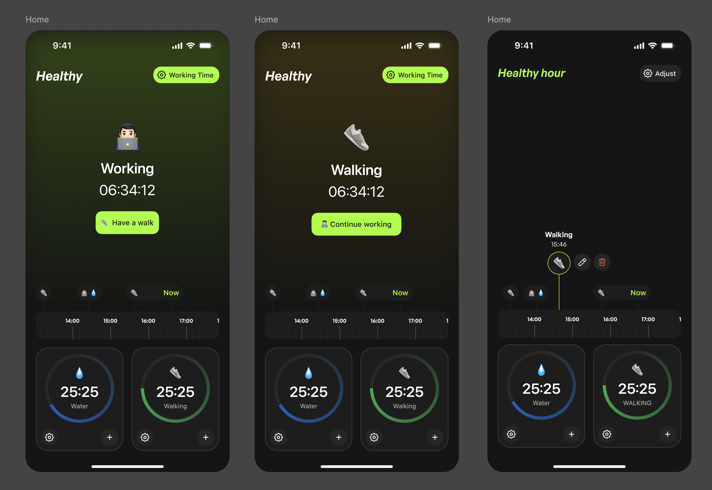

# Project Portfolio

I am Atabek, a Mobile and Backend Developer and AI Enthusiast with a huge love for Dart, Node.js, Django, RDBMS, REST API and Algo problem solving.

A curated showcase of production-grade software projects demonstrating full-stack development expertise across mobile applications, backend services, SaaS platforms, and developer tooling.

## Projects Index

### Mobile Apps

- [THXConnect](#thxconnect---web3-wallet--dao-platform) - Web3 Wallet & DAO Platform
- [Digitax](#digitax---mobile-financial-application) - Mobile Financial Application
- [Raqam971](#raqam971---uae-marketplace-app) - UAE Marketplace App
- [Minefit](#minefit---fitness-mobile-app) - Fitness Mobile App
- [TeamTime](#teamtime---time-tracking-for-basecamp) - Time Tracking for Basecamp
- [HealthyHour](#healthyhour---activity-tracking-app) - Activity Tracking App
- [Minkabu Wallet](#minkabu-wallet---web3-credential-wallet) - Web3 Credential Wallet
- [XPOT](#xpot---community-rewards-platform) - Community Rewards Platform

### Backend Services

- [Notification Service](#notification-service---backend-service) - Push Notification Backend
- [GPS-Tracker](#gps-tracker---real-time-gps-tracking-backend) - Real-Time GPS Tracking
- [Hebent-Logtech](#hebent-logtech---gps-tracking-integration) - Fleet Management Integration

### Web Applications

- [Route and Route](#route-and-route---logistics-saas-platform) - Logistics SaaS Platform
- [Kiçi Bag](#kiçi-bag---industrial-polymer-supply-website) - B2B Industrial Website

### Packages & CLI Tools

- [Lsync](#lsync---translation-sync-cli-tool) - Translation Sync CLI Tool
- [ft-core](#ft-core---blockchain-ft-library) - Blockchain FT Library

---

## Mobile Apps

### [THXConnect](thxconnect/) - Web3 Wallet & DAO Platform

Crypto wallet with NFT management, DAO governance, and Japanese market features (My Number).

**Links:** [Website](https://thxnet.org/) | [iOS](https://apps.apple.com/us/app/thxconnect/id6471815589) | [Android](https://play.google.com/store/apps/details?id=org.thxnet.thxconnect&pcampaignid=web_share)

**Featured:** [Yahoo Finance](https://finance.yahoo.com/news/thxnet-announces-silver-sponsorship-teamz-060400912.html) | [HR Asia](https://hr.asia/media-outreach/thxnet-launches-thxconnect-a-revolutionary-mobile-app-for-blockchain-developers/) | [THXNet Medium](https://thxnet.medium.com/thxconnect-a-one-stop-app-platform-for-developers-to-explore-build-connect-and-discover-thxnet-524ca70836d4)

**Stack:** Flutter, GraphQL (Ferry), gRPC, Protocol Buffers, Firebase

**Role:** Mid-Senior Full-Stack Developer (3 yrs 3 mos)

[View Details →](thxconnect/README.md)

---

### [Digitax](digitax/) - Mobile Financial Application

Flutter-based payment processing app with Clean Architecture, Stripe integration, and offline-first data synchronization.

**Links:** [Website](https://digitax.ie/) | [iOS](https://apps.apple.com/us/app/digitax/id6578443763) | [Android](https://play.google.com/store/apps/details?id=com.corina.cashsnapp)

**Stack:** Flutter, Firebase, Stripe, RxDart, Hive

**Role:** Senior Mobile App Engineer, Contract (1 yr 11 mos)

[View Details →](digitax/README.md)

---

### [Raqam971](raqam971/) - UAE Marketplace App

Marketplace for buying and selling exclusive plate numbers and phone numbers across the UAE.

**Links:** [Website](https://raqamapp.ae/) | [Android](https://play.google.com/store/apps/details?id=ae.raqamapp)

**Stack:** Flutter, Chopper, RxDart, GetIt, GoRouter, Hive, Firebase

**Role:** Lead Flutter Mobile Developer (6 mos)

[View Details →](raqam971/README.md)

---

### [Minefit](minefit/) - Fitness Mobile App

Live and recorded fitness lessons from professional trainers, making training accessible anytime, anywhere.

**Links:** [Website](https://minefit.jp/) | [iOS](https://apps.apple.com/us/app/minefit-%E8%87%AA%E5%AE%85%E3%81%A7%E3%83%95%E3%82%A3%E3%83%83%E3%83%88%E3%83%8D%E3%82%B9-%E8%87%AA%E5%AE%85%E3%83%88%E3%83%AC%E3%83%BC%E3%83%8B%E3%83%B3%E3%82%B0/id1521495780) | [Android](https://play.google.com/store/apps/details?id=jp.joyfit.minefit&hl=pt)

**Stack:** Flutter, Rust, PostgreSQL, WebRTC, Socket.io, Firebase

**Role:** Senior Mobile Developer

[View Details →](minefit/README.md)

---

### [TeamTime](teamtime/) - Time Tracking for Basecamp

Yet another time tracker for Basecamp, done right: live Basecamp integration (no extra accounts), 1–2 tap logging, sane pricing (free up to 3 projects/users; $25 flat beyond), and privacy-first storage of only the minimum data needed.

**Links:** [Website](https://www.trackteamtime.com/) | [iOS](https://apps.apple.com/us/app/teamtime-for-basecamp/id1222445133) | [Android](https://play.google.com/store/apps/details?id=com.clearbluedesign.teamtime&pcampaignid=web_share)

**Stack:** Flutter, Firebase (Analytics/FCM/Crashlytics/Performance), Bloc, SharedPreferences, flutter_downloader, Basecamp OAuth

**Role:** Mobile Engineer

[View Details →](teamtime/README.md)

---

### [HealthyHour](healthyhour/) - Activity Tracking App

Wellness app for work-life balance with activity tracking, smart reminders for movement breaks, and health monitoring.

**Links:** _Under Development_

**Stack:** Flutter, Node.js, Firebase, GitHub Actions

**Role:** Personal Project

[View Details →](healthyhour/README.md)

---

### [Minkabu Wallet](minkabu-wallet/) - Web3 Credential Wallet

Web3 wallet for managing digital credentials (NFTs) with QR verification, biometric auth, and passwordless login.

**Links:** [Website](https://minkabu.co.jp/) | [iOS](https://apps.apple.com/us/app/web3-wallet/id6446136975)

**Featured:** [Bloomberg](https://www.bloomberg.com/profile/company/2027325D:JP) | [THXNet Article](https://thxnet.medium.com/thxnet-use-case-minkabu-web3-wallet-introduce-innovative-employee-id-nft-solution-and-blockchain-fd9920058226)

**Stack:** Flutter, Chopper, RxDart, GetIt, Hive, Firebase, Dartz

**Role:** Mobile Engineer

[View Details →](minkabu-wallet/README.md)

---

### [XPOT](xpot/) - Community Rewards Platform

Community rewards and engagement platform with location-based discovery, QR stamp collection, and multi-language support.

**Links:** _[Website]_ | _[iOS]_ | _[Android]_

**Stack:** Flutter, gRPC, Protocol Buffers, RxDart, GetIt, Hive, Firebase

**Role:** Mobile Engineer

[View Details →](xpot/README.md)

---

## Backend Services

### [Notification Service](notification-service/) - Backend Service

Rust gRPC notification microservice for THXCONNECT that stores devices/notifications in Postgres and delivers push messages via Firebase Cloud Messaging. Runs DB migrations on boot, validates FCM tokens, and exposes RPCs to register/deregister devices, fetch notifications, and send user or broadcast pushes.

**Role:** Backend developer

[View Details →](notification-service/README.md)

---

### [GPS-Tracker](gps-tracker/) - Real-Time GPS Tracking Backend

Production TCP server parsing binary protocols from Teltonika GPS devices with WebSocket streaming.

**Stack:** Node.js, TypeScript, Express, PostgreSQL, Prisma, WebSocket

**Role:** Personal Project

[View Details →](gps-tracker/README.md)

---

### [Hebent-Logtech](hebent-logtech/) - GPS Tracking Integration

Production deployment of GPS-Tracker service for Hebent Logistics fleet management.

**Stack:** GPS-Tracker service, Docker, PostgreSQL

**Role:** Backend Developer

[View Details →](hebent-logtech/README.md)

---

## Web Applications

### [Route and Route](route-and-route/) - Logistics SaaS Platform

Full-stack logistics management platform connecting shippers with carriers (Uber for Trucks).

**Links:** [Website](https://routenroute.com/)

**Stack:** Next.js, Express, PostgreSQL, Prisma, Zustand, React Leaflet

**Role:** Personal Project

[View Details →](route-and-route/README.md)

---

### [Kiçi Bag](kici-bag/) - Industrial Polymer Supply Website

B2B website for Turkmenistan-based polymer supplier with multilingual support.

**Links:** [Website](https://kicibag.com/)

**Stack:** React, TypeScript, Vite, Tailwind CSS, Formspree

**Role:** _[Add role]_

[View Details →](kici-bag/README.md)

---

## Packages & CLI Tools

### [Lsync](lsync/) - Translation Sync CLI Tool

Rust-based CLI tool synchronizing translations from Google Sheets to Flutter/React projects.

**Links:** [GitHub](https://github.com/kaysman/lsync)

**Stack:** Rust, Tokio, Google Sheets API, Clap

**Role:** Personal Project

[View Details →](lsync/README.md)

---

### [ft-core](ft-core/) - Blockchain FT Library

Rust-based fungible token management library for THX Network's multi-chain ecosystem with atomic Redis operations.

**Links:** _Private_

**Stack:** Rust, Tokio, subxt, sp-core, Redis, Protocol Buffers, gRPC

**Role:** Full-Stack Developer

[View Details →](ft-core/README.md)

---

## Technical Highlights

**Languages:** TypeScript, Dart, Rust

**Frontend:** React, Next.js, Flutter

**Backend:** Node.js, Express

**Databases:** PostgreSQL with Prisma ORM

**Mobile:** Flutter (iOS & Android)

**APIs:** REST, GraphQL, gRPC, WebSocket

## Architecture Patterns

- **Clean Architecture** (Digitax, THXConnect)
- **Layered Architecture** (GPS-Tracker, Route and Route API)
- **Repository Pattern** (Route and Route, GPS-Tracker)
- **BLoC Pattern** (Flutter apps)
- **Feature-based Modules** (All projects)

## Contact

Private projects developed under commercial contracts. Detailed code samples and demos available upon request for portfolio review.
