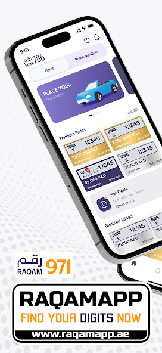

# Raqam971

[Website](https://raqamapp.ae/) | [Play Store](https://play.google.com/store/apps/details?id=ae.raqamapp)


## Overview

Discover a unique marketplace with Raqam971, where you can buy and sell exclusive plate numbers and phone numbers across the UAE. Whether you're looking to stand out with a custom plate or secure a premium phone number, Raqam971 makes it easy. Join today and find your perfect match in just a few clicks!

## Screenshots



## Tech Stack

- **Framework:** Flutter SDK
- **State Management:** Custom BLoC pattern with RxDart
- **API Client:** Chopper (REST)
- **Dependency Injection:** GetIt + Injectable
- **Navigation:** GoRouter
- **Local Storage:** Hive, Flutter Secure Storage
- **Backend Services:** Firebase (Messaging, Crashlytics, Analytics)
- **Code Generation:** Freezed, JSON Serializable, Build Runner

## Platform

- Android

## Features

- **Marketplace Listings:** Browse and search exclusive plate numbers and phone numbers
- **Buy & Sell:** List your own numbers or purchase from other sellers
- **Emirate Filtering:** Filter listings by UAE emirates
- **User Profiles:** Manage your listings and account
- **Favorites:** Save and track preferred listings
- **Push Notifications:** Stay updated on new listings and offers
- **Secure Authentication:** OTP-based phone verification

## Architecture

The application follows **Clean Architecture** principles with a modular feature-based structure:

```
lib/
├── core/                    # Shared utilities, themes, extensions
│   ├── api/                 # Chopper API client setup
│   ├── bloc/                # Base BLoC classes with RxDart
│   ├── di/                  # GetIt dependency injection
│   └── router/              # GoRouter configuration
├── features/                # 21 feature modules
│   ├── auth/                # Authentication (OTP verification)
│   ├── home/                # Main dashboard
│   ├── listings/            # Plate & phone number listings
│   ├── favorites/           # Saved listings
│   ├── profile/             # User profile management
│   ├── search/              # Search & filtering
│   └── ...                  # Additional feature modules
└── main.dart
```

**Key Architectural Decisions:**

- **Custom BLoC Pattern:** Lightweight state management using RxDart streams without external BLoC library dependency
- **Repository Pattern:** Clean separation between data sources and business logic
- **Injectable DI:** Compile-time dependency injection with code generation
- **Feature Isolation:** Each feature is self-contained with its own BLoC, repository, and UI components
