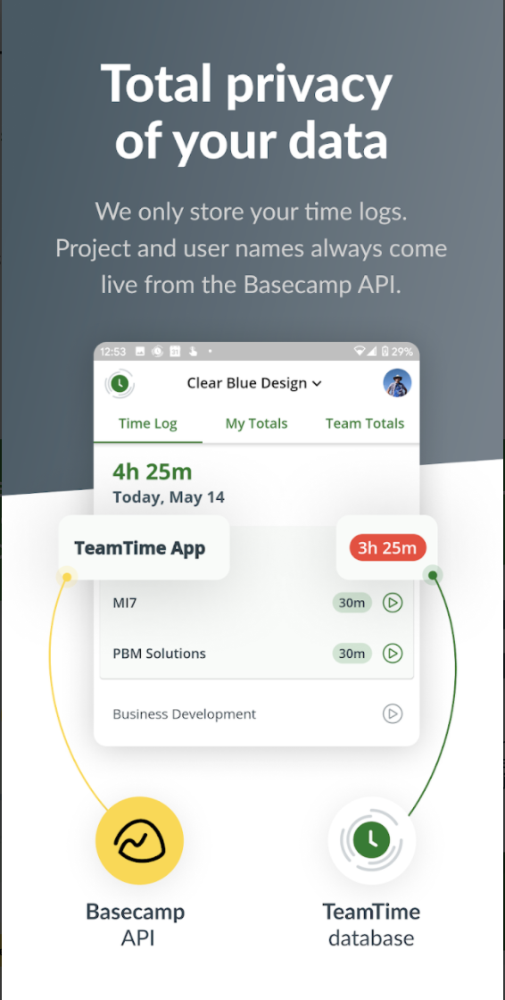

# TeamTime

[Website](https://www.trackteamtime.com/) | [App Store](https://apps.apple.com/us/app/teamtime-for-basecamp/id1222445133) | [Play Store](https://play.google.com/store/apps/details?id=com.clearbluedesign.teamtime&pcampaignid=web_share)

## Overview

Yet another time tracker for Basecamp, done right: live Basecamp integration (no extra accounts), 1–2 tap logging, sane pricing (free up to 3 projects/users; $25 flat beyond), and privacy-first storage of only the minimum data needed.

## Screenshots

## Tech Stack

- Flutter (Dart ≥2.12)
- Firebase (Analytics, Messaging/FCM, Crashlytics, Performance)
- Basecamp OAuth
- Bloc state management
- SharedPreferences for local cache/env flags
- flutter_downloader, local notifications

## Platform

- iOS & Android

## Features

- Basecamp sign-in, device registration (UDID + FCM token)
- Start/stop timers; add/edit/delete time with notes; calendar of days with time
- Project/todo list selection and user/project bucketed reporting
- Personal and admin totals with charts; weekly review/submit flow
- CSV export for teams or individual users

## Architecture

- Bloc-driven UI with MultiBlocProvider wired in `AppService`
- REST client in `lib/Data/services/teamtime.service.dart` hitting prd `api.trackteamtime.com` or dev `teamtime-api-prd.azurewebsites.net`
- Firebase + local notifications initialized at app start; SharedPreferences-backed environment/credential storage
